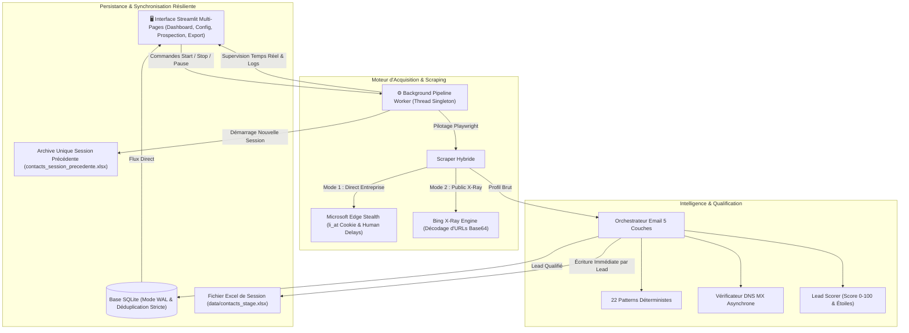

# 🏛️ Architecture Technique Détaillée — LinkedIn Prospector V3.1

Ce document présente l'architecture complète, les flux de données, les composants logiciels et les mécanismes de résilience du système **LinkedIn Prospector V3.1**.

---

## 📌 1. Vue d'Ensemble & Philosophie

**LinkedIn Prospector** est un système automatisé de prospection et d'enrichissement de contacts B2B / candidatures de stage. Il combine une interface utilisateur réactive (Streamlit), un moteur de scraping hybride indétectable (Playwright / Edge), un orchestrateur d'emails déterministe avec validation DNS MX, et une persistance résiliente aux pannes (SQLite WAL & écriture continue Excel).

### 🎯 Objectifs Clés :
* **Zéro perte de données :** Écriture immédiate sur disque par contact qualifié et sauvegarde prioritaire en cas d'arrêt d'urgence ou de coupure.
* **Haute performance :** Qualification et génération d'emails en moins de **10 millisecondes** par profil.
* **Isolation par session :** Compteurs et exports renouvelés à chaque session avec archivage automatique de la session précédente.
* **Indétectabilité :** Empreinte Microsoft Edge native, délais gaussiens et respect strict des quotas de warm-up.

---

## 🏗️ 2. Schéma Architectural Global



---

## 🧩 3. Description des 6 Couches Logicielles

### 1️⃣ Couche Interface Utilisateur (`app/`)
Construite avec **Streamlit** en architecture multi-pages avec thémisation CSS professionnelle :
* `01_Dashboard.py` : Métriques clés de la session (repart à 0 au démarrage), graphiques Plotly de répartition et tableau des contacts en direct.
* `02_Configuration.py` : Gestion des profils de ciblage (mise à jour directe du profil actif, création de nouveaux profils, sélection géographique Maroc/France).
* `03_Prospection.py` : Centre d'exécution avec contrôles en direct (Start, Pause, Resume, Arrêt d'urgence) et console de logs.
* `04_Contacts.py` : Explorateur et filtre de la base de données avec modification en ligne.
* `05_Export.py` : Exportation dédiée par session ou base complète, téléchargement Excel/CSV et accès à l'archive unique de secours.
* `06_Logs.py` : Journalisation d'audit et traçabilité de sécurité.

### 2️⃣ Couche Worker Asynchrone (`core/worker/pipeline_worker.py`)
* **Singleton Thread-Safe :** Exécution du scraping dans un thread séparé (`threading.Thread`) avec boucle événementielle `asyncio` dédiée.
* **Contrôle d'exécution :** États `is_running`, `is_paused`, `should_stop` surveillés sans bloquer l'interface UI.
* **Tolérance aux pannes :** En cas d'arrêt manuel (`stop_job()`), tous les contacts en mémoire vive sont immédiatement écrits en base SQLite et dans le fichier Excel sur disque avant la fermeture du navigateur.

### 3️⃣ Couche Scraping Hybride & Anti-Détection (`scrapers/`)
* **Double Moteur :**
  1. *LinkedIn People Page :* Extraction ciblée sur les employés de l'entreprise cible (`/company/<slug>/people/?keywords=...`).
  2. *Bing X-Ray Search :* Requêtes publiques optimisées en clauses `OR` avec décodage automatique des URLs de redirection Bing (`/ck/a?u=...`) vers les vrais profils LinkedIn `/in/identifiant`.
* **Indétectabilité :** Profil Microsoft Edge persistant, User-Agent natif, émulation de mouvements de souris non-linéaires et délais gaussiens aléatoires (`core/security/rate_limiter.py`).

### 4️⃣ Couche Orchestrateur Email & Scoring (`enricher/`)
* **Génération d'Email Déterministe :** Application de 22 formats de permutation (`prenom.nom`, `p.nom`, `nom.prenom`, `prenom_nom`, etc.) basés sur le domaine de l'entreprise résolu (`company_resolver.py`).
* **Validation DNS MX :** Test direct des serveurs de messagerie (Exchange, Google Workspace, serveurs dédiés) sans envoi d'email ni connexion SMTP intrusive.
* **Lead Scoring :** Calcul d'un score de confiance (0-100%) et attribution d'étoiles (★★★ Décideur/RH, ★★☆ Technique, ★☆☆ Autre).

### 5️⃣ Couche Persistance & Déduplication (`storage/db_manager.py`)
* **SQLite en mode WAL (Write-Ahead Logging) :** Permet des lectures ultra-rapides et concurrentes par l'interface UI pendant que le worker écrit en arrière-plan.
* **Déduplication Stricte :** Déduplication intelligente sur URL normalisée LinkedIn ET sur le triplet `(LOWER(first_name), LOWER(last_name), LOWER(company))`.

### 6️⃣ Couche Exportation & Cycle de Vie Excel (`storage/exporter.py`)
* **Cycle de vie par session :**
  * *Au démarrage d'une session :* L'ancien fichier `contacts_stage.xlsx` est déplacé vers `data/exports/contacts_session_precedente.xlsx`. Le fichier actif est réinitialisé à **0**.
  * *En direct (Résistance aux coupures) :* Chaque contact qualifié est **instantanément écrit sur disque**. En cas de coupure d'électricité, le fichier Excel contient 100% des contacts trouvés jusqu'à la dernière seconde.
  * *Mise en forme :* En-têtes stylisés, bordures fines, colorations conditionnelles (Vert = Validé MX, Jaune = À vérifier, Rouge = Non vérifiable) et ajustement automatique des largeurs de colonnes.

---

## 🗂️ 4. Arborescence du Projet

```text
autmation/
├── app/                                    # Interface Utilisateur Streamlit
│   ├── streamlit_app.py                   # Point d'entrée & routage
│   ├── pages/
│   │   ├── 01_Dashboard.py                # Tableau de bord temps réel
│   │   ├── 02_Configuration.py            # Gestion des profils & critères
│   │   ├── 03_Prospection.py              # Centre de commande d'exécution
│   │   ├── 04_Contacts.py                 # Explorateur & éditeur de leads
│   │   ├── 05_Export.py                   # Téléchargement & archives
│   │   └── 06_Logs.py                     # Journal d'audit et sécurité
│   ├── components/                        # Composants graphiques réutilisables
│   │   ├── charts.py                      # Graphiques Plotly
│   │   ├── metrics.py                     # Cartes KPI de session & globales
│   │   ├── notifications.py               # Toasts et bandeaux d'alerte
│   │   └── sidebar.py                     # Navigation latérale
│   └── utils/
│       ├── data_processor.py              # Calculs statistiques & agrégations
│       ├── export_helper.py               # Générateur de flux Excel/CSV
│       └── state_manager.py               # Persistance d'état session_state
│
├── core/                                  # Cœur Technique & Moteur
│   ├── auth/
│   │   ├── auth_manager.py                # Vérification de connexion LinkedIn
│   │   └── cookie_manager.py              # Validation du cookie li_at
│   ├── browser/
│   │   └── stealth_browser.py             # Navigateur Playwright Stealth (Edge)
│   ├── monitoring/
│   │   └── audit_logger.py                # Logger d'événements système
│   ├── security/
│   │   ├── rate_limiter.py                # Délais aléatoires & pauses anti-bot
│   │   └── warmup_engine.py               # Gestionnaire de montée en charge
│   └── worker/
│       └── pipeline_worker.py             # Worker Asynchrone (Singleton)
│
├── enricher/                              # Intelligence Email & Scoring
│   ├── email_generator.py                 # 22 formats de permutation
│   ├── email_orchestrator.py              # Orchestrateur d'enrichissement instantané
│   ├── email_validator.py                 # Résolveur DNS MX
│   └── lead_scorer.py                     # Algorithme de notation et étoiles
│
├── scrapers/                              # Moteurs d'Extraction
│   ├── hybrid_scraper.py                  # Scraper principal & synchronisation
│   ├── linkedin_browser.py                # Extraction LinkedIn & Bing X-Ray
│   └── parsers/
│       ├── dom_parser.py                  # Nettoyage et parsing des noms
│       └── strategy_parser.py             # Sélecteurs DOM résilients
│
├── storage/                               # Persistance & Fichiers
│   ├── db_manager.py                      # Gestionnaire SQLite WAL & déduplication
│   └── exporter.py                        # Générateur Excel openpyxl & archivage
│
├── data/                                  # Fichiers de Données & Configuration
│   ├── prospector.db                      # Base de données SQLite
│   ├── contacts_stage.xlsx                # Fichier Excel actif de la session
│   ├── active_config.json                 # Configuration active en cours
│   ├── search_profiles.json               # Profils de recherche sauvegardés
│   └── exports/
│       └── contacts_session_precedente.xlsx # Archive unique de la session précédente
│
├── tests/                                 # Suite de Tests Automatisés (31 tests unitaires)
└── ARCHITECTURE.md                        # Ce document d'architecture
```

---

## ⚡ 5. Synthèse des Garanties Techniques

| Propriété | Mécanisme Mis en Place | Résultat Concret |
| :--- | :--- | :--- |
| **Résistance aux Coupures** | Écriture continue sur disque à chaque contact qualifié | Aucune perte de données en cas de panne de courant ou crash |
| **Vitesse d'Exécution** | Validation DNS MX directe + mode rapide déterministe | Moins de 10ms par profil extrait |
| **Indétectabilité** | Navigation Edge native + Délais humains gaussiens | Compte LinkedIn protégé contre toute restriction |
| **Nettoyage Automatique** | Décodage d'URLs Bing Base64 + déduplication stricte | 100% de vrais profils uniques sans faux doublons |
| **Ergonomie UI** | Séparation claire Configuration / Prospection / Export | Simplicité d'utilisation et clarté des données |