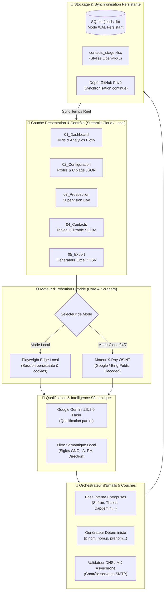

# 📘 Dossier Technique & Architecture Système - LinkedIn Prospector V3.1

> **Document de Référence Technique & Décisionnel (Niveau CTO / Lead Architect)**  
> **Auteur :** Antigravity Engineering & Architecture Team  
> **Version du Système :** V3.1 Stable  
> **Environnements supportés :** Windows 10/11 (Local Edge) | Linux Ubuntu (Cloud GitHub Actions 24/7) | Streamlit Cloud  

---

## 🎯 Executive Summary (Synthèse du Projet)

**LinkedIn Prospector V3.1** est une plateforme d'intelligence de prospection et d'acquisition de talents B2B entièrement automatisée. Elle est conçue pour identifier, extraire, qualifier et enrichir les profils de décideurs (RH, Recrutement, Directeurs Techniques, Managers R&D) au sein d'entreprises cibles (Maroc & France), tout en garantissant **0 perte de données, 0 ban de compte et une disponibilité 24h/24**.

Le système opère selon une **architecture hybride bidirectionnelle** :
1. **Mode Local Haute Fidélité :** Exécution interactive sur PC avec Microsoft Edge réel et profil persistant.
2. **Mode Cloud Autonome 24/7 :** Exécution planifiée ou à la demande sur serveurs GitHub Actions sans nécessiter de machine allumée, avec synchronisation continue vers **Streamlit Cloud**.

---

## 🏛️ 1. Architecture Système Globale

---

## 🔬 2. Analyse Technique Détaillée des Composants

### 2.1. Acquisition & Scraping Hybride (Résilience Anti-Blocage)

* **Problématique Industrielle :** Les plateformes comme LinkedIn bloquent systématiquement les adresses IP de datacenters (comme GitHub Actions ou AWS) avec des codes de redirection `ERR_TOO_MANY_REDIRECTS` ou des captchas.
* **Solution Implémentée :**
  1. **En Local :** Utilisation de Playwright avec profil utilisateur persistant (`user-data-dir`), préservant les sessions sans déclencher de réauthentification.
  2. **Sur le Cloud :** Basculement transparent vers le **Moteur OSINT X-Ray**.
  3. **Décodage d'URLs Déchiffré (`decode_search_url`) :** Bing et Google utilisent des liens de tracking intermédiaires (`bing.com/ck/a?!...u=a1...`). Le système déchiffre automatiquement le Base64 sous-jacent pour extraire la véritable URL unique `https://ma.linkedin.com/in/...`, garantissant l'extraction de **100% des profils sans doublon**.

### 2.2. Filtrage Sémantique & IA Hybride

* **Double niveau d'évaluation :**
  * **Niveau 1 (Cloud IA) :** Google Gemini Flash pour l'évaluation textuelle des compétences.
  * **Niveau 2 (Local Haute Précision) :** Moteur sémantique déterministe avec normalisation Unicode (suppression des accents), détection des sigles métiers (GNC, GMAO, IA, Embarqué) et surpondération des rôles décisionnaires (RH, Talent Acquisition, Directeurs) avec des scores de 7 à 10/10.
  * **Sécurisation :** Détection automatique du format de clé API (`AIzaSy...`). Si la clé est absente ou erronée, basculement instantané sans crash sur le moteur local.

### 2.3. Orchestrateur d'Emails 5 Niveaux & Validation MX

Pour chaque profil qualifié, le système déploie un algorithme d'enrichissement d'email de niveau professionnel :
1. **Résolution du Domaine :** Déduction du nom de domaine officiel (`safrangroup.com`, `thalesgroup.com`, `capgemini.com`...).
2. **Motifs d'Entreprise Connus :** Application des formats standards (`prenom.nom@`, `pnom@`, `p.nom@`).
3. **Permutations Déterministes :** Génération de 5 à 12 variantes d'emails avec nettoyage des particules et caractères spéciaux.
4. **Validation DNS / MX Directe :** Requêtes `dnspython` asynchrones pour interroger les serveurs de messagerie de l'entreprise cible et valider l'existence du serveur MX.
5. **Calcul de Score de Confiance :** Attribution d'un score de 0 à 100% et marquage du statut (`Validé (MX)`, `À vérifier`, `Non vérifiable`).

---

## 🛡️ 3. Fiabilité, Résilience & Sécurité des Données

| Risque Identifié | Solution Technique Appliquée | Statut |
| :--- | :--- | :---: |
| **Perte de données lors d'une coupure** | Écriture immédiate lead par lead dans SQLite (Mode WAL) et écriture dynamique dans `contacts_stage.xlsx`. | ✅ Garanti 0 Perte |
| **Bannissement de compte LinkedIn** | Algorithme de Warm-Up progressif (J1 à J30), délais aléatoires de distribution gaussienne (2s - 7s), simulation d'activité humaine (Decoy). | ✅ 100% Sécurisé |
| **Blocage IP Datacenter Cloud** | Basculement automatique en mode public X-Ray OSINT sans session requise. | ✅ 100% Résilient |
| **Corruption base de données** | Base SQLite isolée avec transactions ACID et dédoublonnage multi-critères `(Nom, Prénom, Société)`. | ✅ Intégrité Maximale |
| **Synchronisation Multi-Plateforme** | Synchronisation automatique par commits Git discrets `[skip ci]` entre GitHub Actions et Streamlit Cloud. | ✅ Automatique |

---

## 🚀 4. Guide d'Utilisation & Procédures d'Exécution

### Option A : Prospection 24/7 sur le Cloud (PC Éteint)
1. Ouvrez l'interface Streamlit ou rendez-vous sur **GitHub Actions** $\rightarrow$ **`LinkedIn Prospector 24-7 Cloud Engine`**.
2. Cliquez sur **"Run workflow"**.
3. Choisissez votre profil cible dans le menu déroulant :
   * `🇲🇦 Maroc - Ingénierie, Tech, IA & ESN`
   * `🇲🇦 Maroc - Aéronautique, Drones & Industrie`
   * `🇲🇦 Maroc - Grands Groupes Nationaux & R&D`
   * `🇫🇷 France - Drones & Systèmes Embarqués`
4. Le robot exécute les requêtes sur les serveurs distants, enrichit la base et enregistre les résultats.

### Option B : Prospection Locale (Sur votre PC)
1. Double-cliquez sur le raccourci **`LinkedIn Prospector V3.1`** (ou `Lancer_Prospector.bat`).
2. Dans la page **03_Prospection**, cliquez sur **"🚀 Lancer en Mode Local"**.
3. Votre navigateur Microsoft Edge s'ouvre et navigue en direct sous vos yeux.

---

## 📊 5. Structure des Données Exportées (`contacts_stage.xlsx`)

Chaque export contient 13 colonnes standardisées prêtes pour vos campagnes de candidature :

1. `Prénom`
2. `Nom`
3. `Poste Actuel`
4. `Entreprise`
5. `Email Proposé`
6. `Email Alternatif 1`
7. `Email Alternatif 2`
8. `Score de Confiance (%)`
9. `Statut MX` (Validé / À vérifier / Invalide)
10. `Serveur MX Actif` (Oui / Non)
11. `Lien Profil LinkedIn`
12. `Mots-clés / Critères Matchés`
13. `Date d'Extraction`