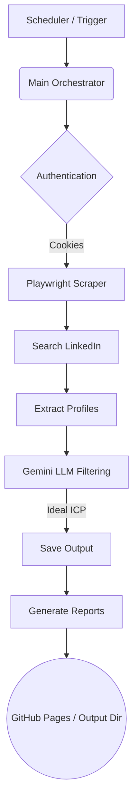

# LinkedIn Prospector V3.2

An automated LinkedIn prospecting tool powered by Playwright and Google's Gemini LLM.

## Architecture Diagram



## Features
- **Automated LinkedIn Search:** Search and scrape LinkedIn profiles.
- **AI-Powered Filtering:** Uses Google's Gemini to filter leads based on ICP criteria.
- **Headless Browser:** Uses Playwright (Chromium) for reliable scraping.
- **CI/CD Pipeline:** Fully automated runs via GitHub Actions with scheduled cron jobs and artifact publishing.

## Setup Instructions

### Environment Variables
Create a `.env` file in the root directory:
```
LINKEDIN_COOKIES='[{"name":"li_at","value":"your_value","domain":".linkedin.com","path":"/"}]'
GEMINI_API_KEY=your_gemini_api_key
```

### How to get Microsoft Edge / Chrome Cookies
1. Install an extension like "Cookie-Editor".
2. Log into LinkedIn on your browser.
3. Open the extension, and export cookies in JSON format.
4. Minify the JSON (put it all in one line) and set it to the `LINKEDIN_COOKIES` environment variable.

### Docker Usage
Ensure you have Docker and Docker Compose installed.

1. Build and run the container:
```bash
docker-compose up --build -d
```
2. View logs:
```bash
docker-compose logs -f
```
3. Stop the container:
```bash
docker-compose down
```

### Troubleshooting
- **Playwright errors:** Ensure all dependencies are installed properly. Running via Docker ensures a pristine environment.
- **LinkedIn Blocked/Logged Out:** Update your cookies. Session cookies (`li_at`) expire or get invalidated if you manually log out from the browser.
- **No Results from Gemini:** Verify your `GEMINI_API_KEY` and check API quota limits.

## Continuous Integration / Continuous Deployment (CI/CD)
The `.github/workflows/prospector.yml` handles automated daily execution.
1. Add `LINKEDIN_COOKIES` and `GEMINI_API_KEY` to your repository's GitHub Secrets.
2. The pipeline will automatically fetch profiles, filter them, and deploy the outputs via GitHub Pages if applicable.
